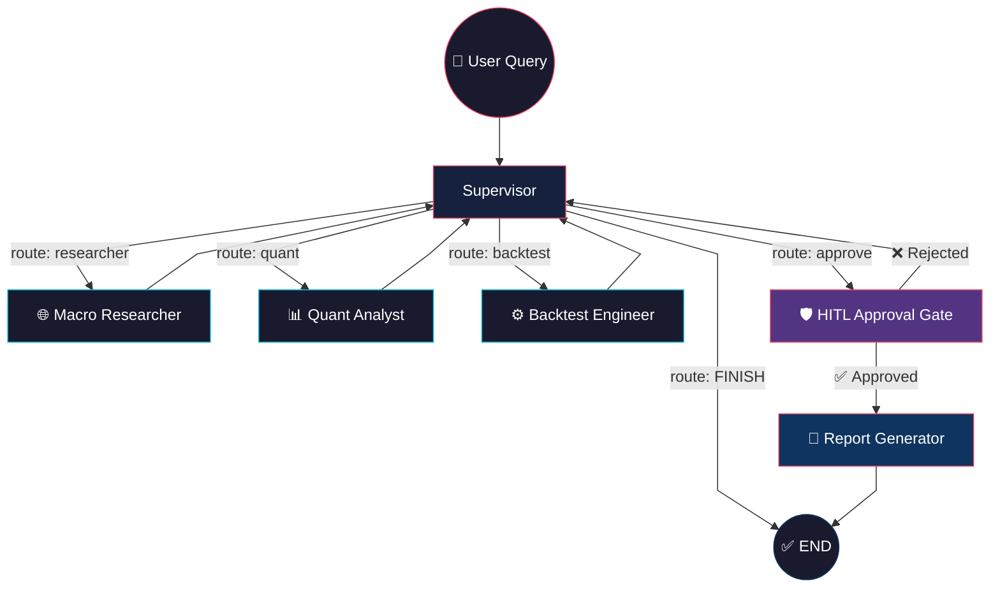
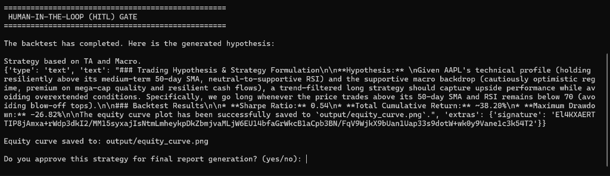

<div align="center">

# 🧠 AlphaAgent

### *A Multi-Agent Quantitative Research Pipeline*

[](https://python.org)
[](https://github.com/langchain-ai/langgraph)
[](https://ai.google.dev/)
[](LICENSE)

**AlphaAgent** orchestrates a team of specialized AI agents that mirror a professional quant desk's workflow — gathering macro sentiment, computing technical indicators, writing & executing backtests, and presenting hypotheses — all gated by a **Human-in-the-Loop (HITL)** checkpoint before final report generation.

<br/>

[Getting Started](#-quick-start) · [Architecture](#-architecture) · [Agents](#-the-agent-team) · [Project Structure](#-project-structure) · [Configuration](#-configuration)

</div>

---

## ✨ Why AlphaAgent?

| Problem | AlphaAgent's Solution |
|---|---|
| LLMs hallucinate math and statistics | **Deterministic tooling** — Technical indicators computed with pure `pandas`, never by the LLM |
| Uncontrolled code execution is dangerous | **Sandboxed subprocess** — Backtests run in isolated subprocesses with 30-second timeouts |
| Blind trust in AI-generated strategies | **Human-in-the-Loop gate** — LangGraph's `interrupt()` primitive pauses the pipeline for human approval |
| Fragile single-agent architectures | **Supervisor pattern** — Explicit `StateGraph` with typed state, conditional routing, and clear separation of concerns |
| API rate limits crash pipelines | **Automatic retry with backoff** — Custom LLM wrapper catches `429`/`RESOURCE_EXHAUSTED` and retries gracefully |

---

## 🏗 Architecture

AlphaAgent uses LangGraph's **explicit `StateGraph`** with a **Supervisor Pattern** — a central routing node that delegates to specialized worker agents based on typed state transitions.



### Pipeline Flow

```
User enters ticker (e.g., AAPL)
        │
        ▼
┌─────────────────┐
│   Supervisor    │ ◄──────────────────────────────────┐
│   (LLM Router)  │                                    │
└────────┬────────┘                                    │
         │ Evaluates state, picks next agent           │
         ▼                                             │
   ┌─────────────┐    ┌──────────────┐                 │
   │ Researcher  │    │ Quant Analyst│                 │
   │ (DuckDuckGo)│    │  (yfinance)  │                 │
   └──────┬──────┘    └──────┬───────┘                 │
          │                  │                         │
          └─────┬────────────┘                         │
                ▼                                      │
        ┌───────────────┐                              │
        │   Backtest    │                              │
        │   Engineer    │                              │
        │  (subprocess) │                              │
        └───────┬───────┘                              │
                ▼                                      │
        ┌───────────────┐        Rejected ─────────────┘
        │  HITL Gate    │
        │  (interrupt)  │
        └───────┬───────┘
                │ ✅ Approved
                ▼
        ┌───────────────┐
        │ Report Writer │ → output/strategy_report.md
        │               │ → output/equity_curve.png
        └───────────────┘
```

---

## 🤖 The Agent Team

### 🎯 Supervisor — *The Orchestrator*
> **File:** [`supervisor.py`](src/agents/supervisor.py)

A pure LLM-powered routing node. Reads the typed `AgentState` (what data has been gathered, what's still missing) and emits structured `Route` decisions. Uses Pydantic schema binding for reliable routing — no regex parsing of free-text responses.

### 📊 Quant Analyst — *The Data Engine*
> **File:** [`quant.py`](src/agents/quant.py) &nbsp;|&nbsp; **Tools:** [`finance.py`](src/tools/finance.py)

Fetches OHLCV data via `yfinance` and computes **SMA(20/50/200)**, **RSI(14)**, and **MACD** using pure `pandas` arithmetic — no LLM-generated math. Built as a LangGraph `ReAct` agent that autonomously decides which tools to call.

### 🌐 Macro & Sentiment Researcher — *The News Analyst*
> **File:** [`researcher.py`](src/agents/researcher.py) &nbsp;|&nbsp; **Tools:** [`search.py`](src/tools/search.py)

Searches for macro events, sentiment shifts, and catalysts using `duckduckgo-search`. Classifies the current market regime (Risk-On, Risk-Off, Catalyst Pending). Includes graceful fallback to synthetic data if the search API is rate-limited, preventing infinite LLM retry loops.

### ⚙️ Backtest Engineer — *The Strategy Builder*
> **File:** [`backtest.py`](src/agents/backtest.py) &nbsp;|&nbsp; **Tools:** [`backtest.py`](src/tools/backtest.py)

The most capable agent. Takes technical + macro intelligence, formulates a trading hypothesis, and **dynamically writes a complete Python backtest script**. The generated code is executed in a sandboxed `subprocess` with a 30-second timeout. Outputs:
- **Sharpe Ratio**, **Total Return**, **Max Drawdown** (as JSON to stdout)
- **Equity curve** saved to `output/equity_curve.png`

### 🛡️ HITL Gate — *The Human Checkpoint*
> **File:** [`graph.py`](src/graph.py) (inline node)

Uses LangGraph's `interrupt_before` compile option to **pause the entire state graph** before this node executes. The human portfolio manager reviews the generated hypothesis and backtest metrics in the terminal, then approves or rejects. On rejection, execution loops back to the Supervisor for revision.



### 📝 Report Generator — *The Final Output*
> **File:** [`graph.py`](src/graph.py) (inline node)

Compiles all gathered intelligence — macro regime, technical summary, backtest hypothesis, and equity curve path — into a structured Markdown strategy report saved to `output/strategy_report.md`.

---

## 📁 Project Structure

```
AlphaAgent/
├── main.py                      # CLI entrypoint — handles HITL interaction loop
├── requirements.txt             # Pinned dependencies
├── .env                         # API keys (git-ignored)
│
├── src/
│   ├── __init__.py
│   ├── graph.py                 # StateGraph definition, HITL gate, report node
│   ├── state.py                 # Typed AgentState (TypedDict + message reducer)
│   ├── llm.py                   # Multi-provider LLM factory + rate-limit wrapper
│   │
│   ├── agents/
│   │   ├── supervisor.py        # Supervisor routing with structured output
│   │   ├── quant.py             # Quant Analyst ReAct agent
│   │   ├── researcher.py        # Macro Researcher ReAct agent
│   │   └── backtest.py          # Backtest Engineer ReAct agent
│   │
│   └── tools/
│       ├── finance.py           # yfinance data + pandas TA indicators
│       ├── search.py            # DuckDuckGo news search + fallback
│       └── backtest.py          # Sandboxed subprocess code executor
│
├── output/                      # Generated artifacts (git-ignored)
│   ├── strategy_report.md       # Final strategy report
│   └── equity_curve.png         # Backtest equity curve plot
├── tests/
│   ├── test_finance.py          # Tool verification: finance data + TA
│   └── test_backtest.py         # Tool verification: subprocess executor
```

---

## 🚀 Quick Start

### Prerequisites

- **Python 3.10+**
- A **Google Gemini API key** (free tier works) — or keys for OpenAI / Groq / Ollama

### 1. Clone & Install

```bash
git clone https://github.com/yourusername/AlphaAgent.git
cd AlphaAgent
pip install -r requirements.txt
```

### 2. Configure Environment

Create a `.env` file in the project root:

```env
# Required — at least one API key
GOOGLE_API_KEY=your_gemini_api_key_here

# Optional — override LLM provider and model
# LLM_PROVIDER=google          # google | openai | groq | ollama
# LLM_MODEL=gemini-2.0-flash   # model name for chosen provider
```

<details>
<summary><b>🔧 Supported LLM Providers</b></summary>

| Provider | Env Vars | Default Model |
|---|---|---|
| **Google Gemini** (default) | `GOOGLE_API_KEY` | `gemini-2.0-flash` |
| **OpenAI** | `OPENAI_API_KEY`, `LLM_PROVIDER=openai` | `gpt-4o-mini` |
| **Groq** | `GROQ_API_KEY`, `LLM_PROVIDER=groq` | `llama-3.3-70b-versatile` |
| **Ollama** (local) | `LLM_PROVIDER=ollama` | `llama3.1` |

</details>

### 3. Run the Pipeline

```bash
python main.py
```

You'll see the agents work in sequence:

```
🚀 Initializing AlphaAgent-LangGraph...

--- Quantitative Research Pipeline ---
Enter a ticker symbol to research (e.g., AAPL): TSLA

🔬 Starting research for TSLA...

[Supervisor] Routing to -> RESEARCHER
[Supervisor] Routing to -> QUANT
[Supervisor] Routing to -> BACKTEST

==================================================
🛡️ HUMAN-IN-THE-LOOP (HITL) GATE
==================================================

The backtest has completed. Here is the generated hypothesis:
...

Do you approve this strategy for final report generation? (yes/no): yes

✅ Strategy Approved! Generating final report...
📄 Check output/strategy_report.md for the final results!
```

### 4. Verify Tools (Optional)

```bash
python tests/test_finance.py    # Tests yfinance data fetching + TA indicators
python tests/test_backtest.py   # Tests sandboxed code execution
```

---

## ⚙️ Configuration

### State Schema

All agent communication flows through a **typed `AgentState`** ([`state.py`](src/state.py)):

```python
class AgentState(TypedDict):
    messages: Annotated[list[AnyMessage], add_messages]  # LangGraph message reducer
    next_agent: str              # Supervisor routing target
    ticker: str                  # Research target
    market_data: dict            # Raw OHLCV data
    technical_analysis: str      # Quant Analyst output
    macro_research: str          # Researcher output
    hypothesis: str              # Backtest Engineer hypothesis
    backtest_code: str           # Generated Python script
    backtest_results: dict       # Parsed JSON metrics
    equity_curve_path: str       # Path to saved plot
    human_approved: bool         # HITL gate decision
    final_report: str            # Compiled markdown report
```

### Rate Limit Handling

The custom [`RateLimitRetryLLM`](src/llm.py) wrapper intercepts `429` / `RESOURCE_EXHAUSTED` errors and automatically retries with parsed or default backoff (up to 5 attempts). This is critical for free-tier API keys.

---

## 🧪 Technical Details

### Why Not Use Pre-Built Wrappers?

AlphaAgent deliberately uses LangGraph's **explicit `StateGraph`** pattern instead of higher-level abstractions like `create_react_agent` for the top-level graph. This gives full control over:

- **State schema** — Typed `TypedDict` with a message reducer
- **Conditional edges** — Deterministic routing based on state fields
- **Interrupt semantics** — `interrupt_before` for the HITL gate
- **Checkpointing** — `MemorySaver` for resumable state after human input

Worker agents (Quant, Researcher, Backtest) *do* use `create_react_agent` internally, since they're self-contained tool-calling loops that don't need custom routing.

### Backtest Sandbox

Generated code runs in a **completely isolated subprocess** (`subprocess.run` with `capture_output=True`). This means:

- A crash in generated code **cannot** crash the main state graph
- Infinite loops are killed after **30 seconds**
- Output is captured via stdout and parsed for JSON metrics
- Temp files are cleaned up in a `finally` block

---

## 🗺️ Roadmap

- [ ] **Persistent checkpointing** — Replace `MemorySaver` with SQLite/PostgreSQL for session recovery
- [ ] **Multi-strategy comparison** — Run multiple backtest variants and rank by Sharpe
- [ ] **Streaming UI** — Real-time agent progress via LangGraph's streaming API
- [ ] **Portfolio-level analysis** — Multi-ticker correlation and portfolio optimization
- [ ] **Web dashboard** — FastAPI + React frontend for the HITL gate

---

## 📄 License

This project is open-source under the [MIT License](LICENSE).

---

<div align="center">

**Built with [LangGraph](https://github.com/langchain-ai/langgraph) · Powered by [Gemini](https://ai.google.dev/)**

</div>
